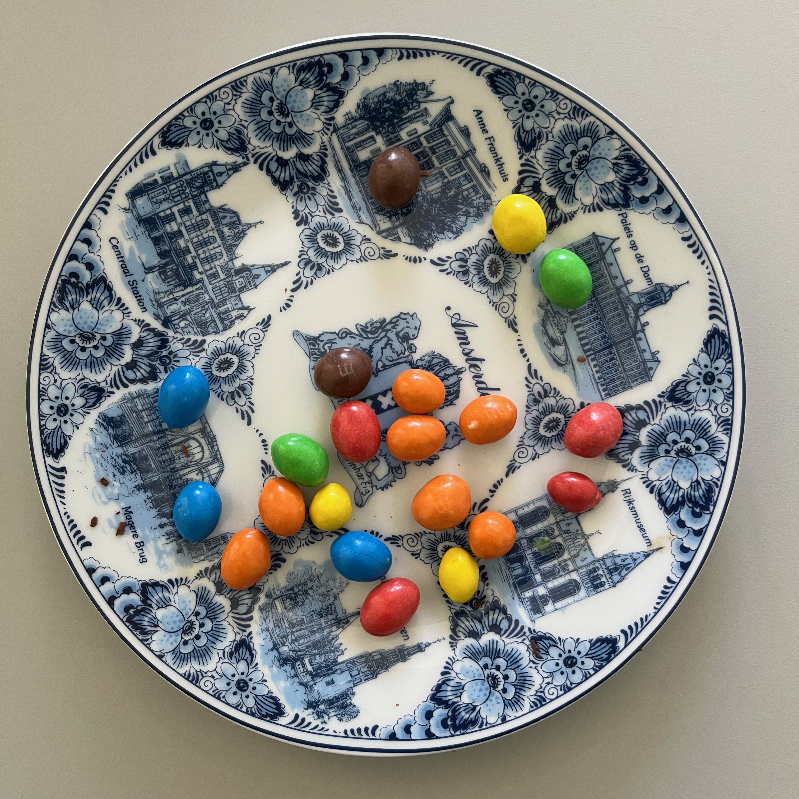

# Analyse d’Image et statistiques pour finaliser l'Étude des M&M's
Dans le fichier `code_detection` on a établit un programme permettant de répertorier les M&amp;M's par couleur

Cette image RVB  nous donne après l'application de l'algorithme de seuillage l'image binaire suivante 
