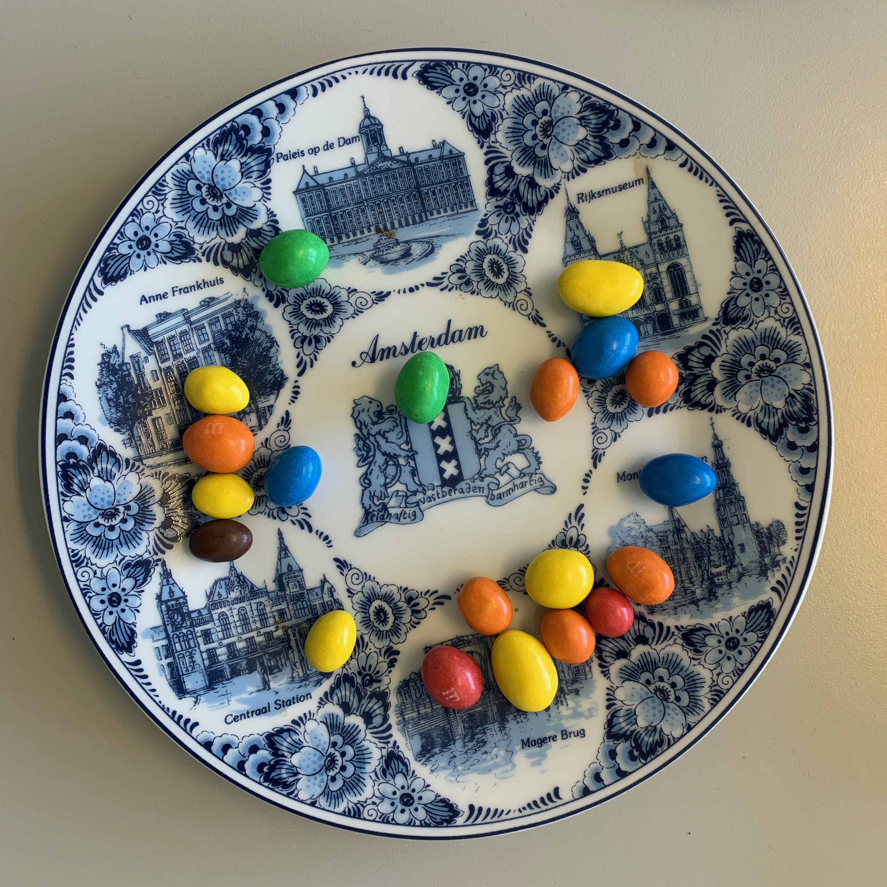

# Analyse d’Image et statistiques pour finaliser l'Étude des M&M's
Dans le fichier `code_detection` on a établit un programme permettant de répertorier les M&amp;M's par couleur

Sur une image {width = 100 ; height = 100} qui donne après application de l'algorithme de seuillage
